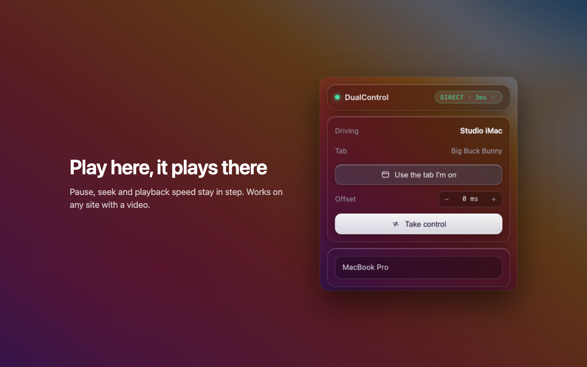

# DualControl

A Chrome extension that pairs two browsers with a 6-digit code. One device
drives, the other follows: same page, same video, same position.

It uses a WebRTC DataChannel when both machines can reach each other directly,
and a WebSocket relay when they can't. Switching between them is automatic and
doesn't drop commands.

Works on any site with a `<video>` element, since it drives the standard
`HTMLMediaElement` API instead of any specific player.

A relay is already running at `https://dualcontrol.onrender.com`, so the
extension works out of the box with no server to set up.



## Install it

Not on a store yet, so it installs unpacked. Two minutes, and it works on
Chrome, Brave, Edge, Arc, Opera or any other Chromium browser.

1. Download `dualcontrol-1.0.0.zip` from
   [Releases](https://github.com/0xAnirudh/duo/releases), and unzip it.
2. Open `chrome://extensions` (`brave://extensions`, `edge://extensions`).
3. Turn on **Developer mode**, top right.
4. Click **Load unpacked** and select the unzipped folder, the one containing
   `manifest.json`.
5. Repeat on the second device, or in a second browser profile.

To build it yourself instead of downloading:

```bash
git clone https://github.com/0xAnirudh/duo.git
cd duo/extension && npm install && npm run build
```

Then load `extension/dist` at step 4.

### Pairing

1. **Open the video first**, then click the extension. It syncs whichever tab
   is in front when you pair. If you get it wrong, hit **Use the tab I'm on**.
2. Click **Host a session**. Six digits appear.
3. On the other device, click the extension, **Enter a code**, type them.

A green dot and a latency reading in both popups means it is live. Play, pause
and seek on the driving device; the other follows. The follower's own controls
do nothing until it clicks **Take control**.

If the follower will not start playing, the browser blocked autoplay on a tab
nobody has touched. Click the video once. The popup says so when it happens.

### Running your own relay

The hosted one is a free instance and it is not private to you. To run your
own, deploy `server/` anywhere that supports WebSockets, then set `serverUrl`
in the extension's `chrome.storage.local`, or change `DEFAULT_SERVER` in
`extension/shared/config.js` and rebuild. `render.yaml` and `fly.toml` are both
in the repo. Vercel and Netlify cannot host it: it needs a persistent
connection, not serverless functions.

## Numbers

A 60Hz display refreshes every 16.7ms. Two screens that pause within one frame
of each other look identical to someone watching both, so that's the target.

| What | Result |
|---|---|
| Command latency, localhost | p50 0.17ms, p95 0.31ms |
| Relay, 150 concurrent rooms | round trip p50 4ms, p95 9ms |
| Command latency, deployed relay in Singapore | p50 104ms, p95 108ms |
| Throughput at that load | 19,200 msg/s, 11,866 rooms, 0 failures |
| Pairing handshake, 25 rooms | p50 7ms |
| Clock agreement | under 1ms, with an 8s wall clock skew absorbed |
| Drift, 30 min at 0.2% decode error | worst gap 0.086s, no hard seeks |
| Drift, 30 min at 1% decode error | worst gap 0.110s, no hard seeks |
| Content script bundle | 1.5 KB gzipped |

Relay numbers come from `k6 run server/bench/k6-relay.js` against localhost, so
they measure the server's forwarding cost rather than the network. Drift
numbers come from a simulated player in `npm test`.

Command latency is the time from pressing pause on one device to the other
receiving it: one traversal of client, server, client. The k6 round trip is two
of those, since the peer bounces the message back.

Region is the whole wide-area number. The same deployment, measured from India,
on Render's US default versus Singapore:

| Region | Command latency |
|---|---|
| Oregon, US | p50 272ms |
| Singapore | p50 104ms |

One line of `render.yaml`. Nothing about the code changed, and the same code
forwards in 0.17ms on localhost, so effectively all of it is distance.

Not measured yet: DataChannel latency on a real LAN, which needs two machines.

## Layout

```
server/
  src/
    index.js       express + socket.io
    rooms.js       room registry, code allocation, TTL
    handlers.js    join, relay, signalling, control
    clock.js       clock sync endpoint
    rateLimit.js   join limits and lockout
  bench/k6-relay.js

extension/
  background/      service worker, offscreen lifecycle, url sync
  offscreen/       socket, clock, peer connection
  content/         video discovery, echo suppression, drift
  popup/           react ui
  shared/          protocol constants
```

Outbound messages all leave through one `send()` in
`offscreen/connection.js`. It uses the DataChannel when `ctrl.readyState` is
`open` and the socket otherwise, so nothing upstream knows which was used.

## Why the offscreen document

An MV3 service worker is killed after 30 seconds of inactivity. Extension
events reset that timer but WebSocket frames don't, so a socket opened in the
worker dies silently and takes the pairing with it.

An offscreen document created with reason `WEB_RTC` has no lifetime limit and
is a real DOM context, so it can hold both the socket and an
`RTCPeerConnection`. Neither exists in a service worker at all.

So the connection, clock and peer connection live in the offscreen document,
and `chrome.tabs` stays in the worker. The offscreen document pings the worker
every 20 seconds, which counts as an extension event and keeps it warm.

## Notes on the tricky parts

**Echo suppression.** `video.pause()` queues its event instead of firing it
synchronously, so a flag set and cleared around the call is already back to
`false` by the time the handler runs. The handler then treats a remote command
as a local one and sends it back, and the two devices bounce it forever. A
300ms window cleared by elapsed time fixes it. `test/echo.test.mjs` runs both
versions against a fake element that queues events like a real one, and asserts
the flag version echoes.

**Clock offset.** `Date.now()` on two machines can differ by seconds. Both run
a four-timestamp NTP handshake against the server and keep the lowest-RTT
sample out of seven rather than the average, since a sample delayed by a queued
packet is skewed on one leg only. Once the DataChannel opens the handshake runs
again peer to peer, with one side as the reference.

**Latency compensation.** A command is stale by the time it lands: the
controller kept playing while it was in flight. Every applied position is
projected forward by the measured transit, `mediaTime + (now - ts) * rate`,
using the synced clocks rather than an averaged latency figure. This applies to
play and seek as well as heartbeats. Without it a relay leaves a fixed offset
equal to its one-way latency, and any offset smaller than the dead zone is
permanent, because drift correction is built to ignore exactly that range.

**Drift.** Ignore under 0.08s, adjust `playbackRate` by 3% between 0.08s and
0.5s, hard seek past that. A 3% shift isn't audible and closes the gap without
a visible jump.

The dead zone is 0.08s because that is the knee of the curve. Sweeping it
against a simulated player with frame-grained `currentTime` noise: 0.15s leaves
a 0.090s mean error, 0.08s cuts that to 0.035s for the same number of
corrections, and anything below 0.05s multiplies corrections fifteenfold
chasing measurement noise for no further gain.

**Manual offset.** Displays and audio paths add their own lag, which no amount
of clock sync can see. The popup has a +/- 25ms stepper that shifts this
device's applied position, so a pair that measures in sync but looks off can be
dialled in by eye.

**Control.** The server owns `controllerId` even when the DataChannel is
carrying everything else. It changes once a session so latency doesn't matter,
and a single authority stops both devices from thinking they're driving after a
reconnect.

## Working on it

Run the relay locally by pointing `DEFAULT_SERVER` in
`extension/shared/config.js` at `http://localhost:8787`, then:

```bash
cd server && npm install && npm start
```

Rebuild the extension after any change, and reload it at
`chrome://extensions`:

```bash
cd extension && npm install && npm run build
```

Tests run in both packages, and the load test needs [k6](https://k6.io):

```bash
npm test
k6 run server/bench/k6-relay.js
```

Two browser profiles on one machine exercise everything except the direct
DataChannel, which needs two machines on the same network to be a real test.

## Protocol

JSON, around 100 bytes per message, shaped `{ t, ...fields, ts }`.

| Type | Direction | Delivery |
|---|---|---|
| `HELLO` / `ROOM` | client, server | join or create, reply carries the token |
| `PEER_JOIN` / `PEER_LEAVE` | server to client | reliable |
| `CLOCK_REQ` | client to server | acked |
| `SIGNAL` | peer to peer via server | SDP and ICE |
| `URL` | peer to peer | reliable, debounced 250ms |
| `PLAY` / `PAUSE` | peer to peer | reliable |
| `SEEK` | peer to peer | reliable, throttled 100ms trailing |
| `RATE` | peer to peer | reliable |
| `HEARTBEAT` | peer to peer | unreliable, every 3s |
| `TAKE_CONTROL` / `CONTROLLER` | client, server | reliable, server owns it |

Commands have to arrive. Heartbeats shouldn't queue behind a slow peer, because
a late one reports a playback position that has already moved. On the relay they
go out volatile; on the DataChannel they use a second channel opened with
`{ ordered: false, maxRetransmits: 0 }`.

## Privacy

Full policy: [dualcontrol.onrender.com/privacy](https://dualcontrol.onrender.com/privacy).

Short version: no accounts, no tracking, no analytics, nothing sold. Your
device name and offset stay on your machine. **On the relay path the server can
see the addresses of pages you push to the other device.** It forwards them and
stores nothing, room state is in memory only, and the server code is in this
repo so you can check. On the direct path the traffic never reaches the server
at all.

## Security

A 6-digit code is a 1,000,000 key space, small enough to walk through if
nothing stops you.

- Codes expire after 5 minutes.
- A code is deleted as soon as the second device joins. The room continues
  under a 128-bit `roomId`.
- After joining, every message including reconnects carries a 32-byte token.
  The code is never sent twice.
- 10 join attempts per minute per IP. Five wrong codes locks that address out
  for 5 minutes, and a correct code clears the streak so a mistyped digit
  doesn't lock out a real user.

Limiting a specific code after N failed guesses doesn't help here, because a
wrong guess never reaches a code in the first place, it just misses the map.
The limit has to apply to the address doing the guessing.

On the relay path the server can see every URL that gets pushed. On the direct
path it can't, since DataChannels are DTLS encrypted and the traffic never
reaches the server. Encrypting relay payloads with a key derived from the
pairing code would close that gap, but it isn't built.

## Not built

- No database. Rooms are ephemeral and a `Map` handles TTL fine.
- No accounts. The code is the auth.
- No site-specific handlers. The point is using the standard media API.
- No TURN server. If ICE fails the relay already works.
- One synced tab per room.

## Known issues

- An ad on one device only will desync playback until it finishes, since it
  plays through the same `<video>` element.
- Age-gated or paid content fails on a device that isn't signed in.
- Two devices per room. The relay and the controller model already generalise
  to more, the popup and the WebRTC mesh don't.
